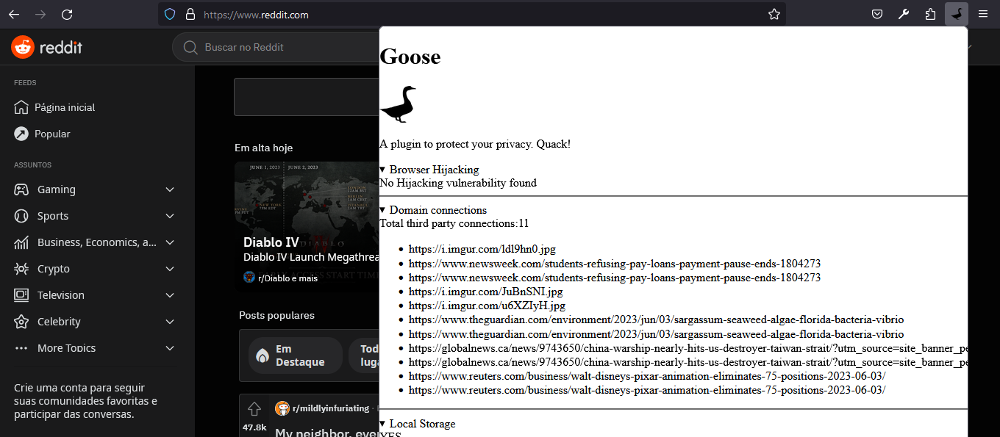
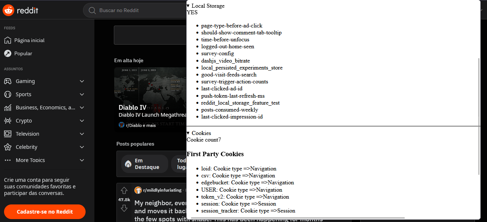

# Goose: detector de privacidade para Firefox

## Nicolas Cho

---
# Uso

Para testar a extensão é necessário o uso do [Firefox Developer Edition](https://www.mozilla.org/pt-BR/firefox/developer/)

Dentro do navegador, digite na aba de endereço:
    
    about:debugging

Em seguida vá para "Este Firefox" na esquerda e aperte no botão de "Carregar extensão temporária..."

Selecione o *manifest.json* deste projeto e a extensão deverá ser habilitada. (obs: Todos os arquivos deverão 
estar como estão estruturados neste diretório para funcionar. Não delete ou altere os arquivos)

# Funcionalidades

O plugin apresenta as seguintes funcionalidades:

- Hijacking: Identifica possibilidade de clickjacking na página (elemento oculto ou disfarçado para o usuário)
- Cookies: Indica a quantidade de cookies e se são First Party ou Third Party. Além disso, identifica se 
são cookies de navegação ou sessão
- Conexões a domínios externos: Lista as possíveis conexões
- Web storage: Indica se está sendo utilizado e os dados correspondentes

# Estrutura

## manifest.json

Arquivo de configuração do plugin. Apresenta o nome, permissões e versão da extensão.

Define o arquivo de pop up(index.html) e os scripts que realizarão requisições (index.js)

## index.html

Arquivo com a estrutura do popup

## index.js

Responsável por capturar as requisições dentro dos outros arquivos js e retornar os dados solicitados (utilizado
para identificar os domínios externos e web storage)

## Demais arquivos

Responsáveis pelas funcionalidades da extensão. Contém a lógica e tratamento dos dados para disponibilizar ao 
usuário.